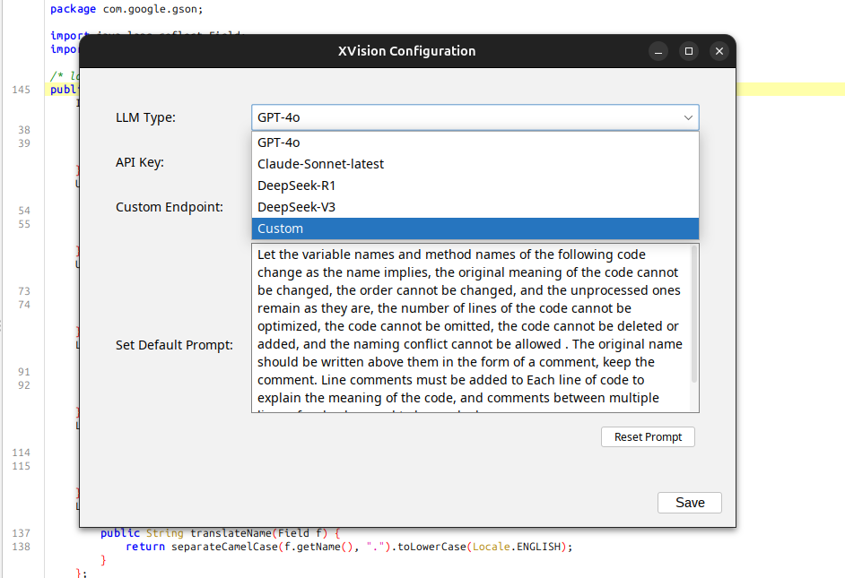
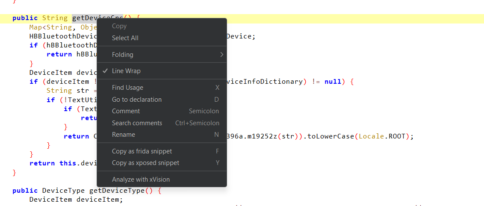
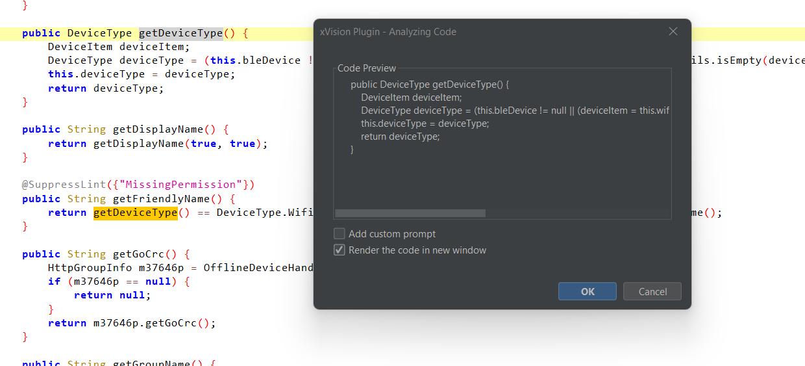
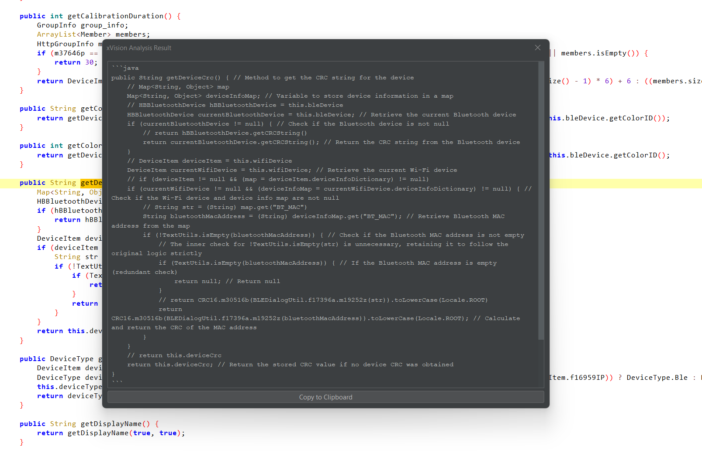

# jadX xVision Plugin

xVision is a plugin for the [JadX](https://github.com/skylot/jadx) decompiler that aims to integrate with Large Language Models (LLMs) to provide code analysis directly in the JAdX. This plugin allows you to analyze Java code for functionality, security issues, and notable patterns using LLMs like GPT-4, Claude or any custom local LLMs.

## Features

- **LLM Integration**: Supports GPT-4 (NOt tested, but should support: Claude, and custom LLMs as well).
- **Code Analysis**: Analyze Java code for functionality, security issues, and notable patterns.
- **Custom Prompts**: Configure custom prompts for analysis.
- **GUI Integration**: Integrates with JadX GUI for easy access.
## Screenshots






## Installation

### Prerequisites

- JadX (CLI or GUI)
- Java Development Kit (JDK) 11 or higher

### Download the jar file from releases

- [jadX-xVision Plugin v0.0.1](https://github.com/samanl33t/jadx-xvision-plugin/releases/download/v0.0.1/jadx-xvision-plugin_v0.0.1.jar)

### Build locally

1. **Clone the repository**:
    ```sh
    git clone https://github.com/samanl33t/jadx-xvision-plugin.git
    cd jadx-xvision-plugin
    ```

2. **Build the plugin**:
    ```sh
    ./gradlew clean build
    ```

3. **Install the plugin**:
    - For `jadx-cli`:
        ```sh
        jadx plugins --install-jar build/libs/jadx-xVision-plugin-dev.jar
        ```
    - For `jadx-gui`:
        - Open JadX GUI.
        - Go to **Plugins** > **Install plugin**.
        - Select the `jadx-xVision-plugin-dev.jar` file from the `build/libs` directory.

## Usage

### JadX GUI

1. **Open JadX GUI**.
2. **Load a Java archive (JAR) file**.
3. **Right-click on a class or method** and select **Analyze with xVision Plugin**.

!JadX GUI

### Configuration

1. **Open the plugin settings**:
    - For `jadx-cli`: Edit the configuration file located at `~/.jadx/plugins/xvision-plugin.properties`.
    - For `jadx-gui`: Go to **Preferences** > **Plugins** > **xVision Plugin**.

2. **Set the API Key and LLM Type**:
    ```properties
    xvision-plugin.apiKey=your-api-key
    xvision-plugin.llmType=GPT-4
    xvision-plugin.customEndpoint=https://your-custom-endpoint.com
    ```

!Plugin Settings

### Custom Prompts

1. **Select a code block** in JadX GUI.
2. **Right-click** and choose **Analyze with xVision Plugin**.
3. **Configure the analysis prompt** in the dialog that appears.

## Contributing

Contributions are welcome! Please open an issue or submit a pull request on GitHub.
